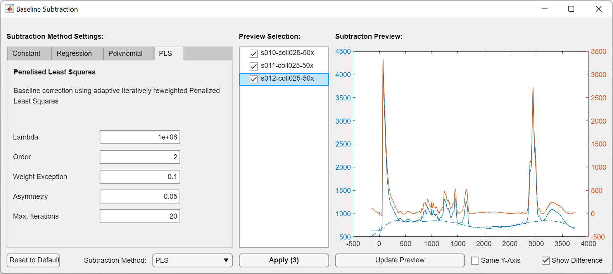

# RAMAT
*RAMAT* is a MATLAB-based software package for quick analysis, spectral correction, and plotting of spectroscopical Raman data.
Data can be imported straight from WiTEC software or as one of the many supported ASCII formats.

# Requirements
**Minimal Requirements:** MATLAB 2021a or newer.

**Additional Recommended Requirements:** Bioinformatics Toolbox

# Quick Start

## Starting RAMAT

**RAMAT** can be run through MATLAB's command line interface (CLI) or through the provided GUI. To start **RAMAT**, run the following command in MATLAB's CLI:

```MATLAB
ramat
```

Do *not* start `ramatgui.mlapp` directly. If you haven't installed the WITIO Toolbox, you'll be asked to install it before proceeding. **RAMAT** can be used without the WITIO Toolbox, however, you'll be unable to directly import data from the WiTEC's software package.

## Importing Data

Through GUI:
1. Data can be imported through the top ribbon toolbar: `General` > `Data` > `Import` or through the top menu: `File` > `Import Data`. A dialog will be opened.
2. Select `WITec` > `Select Files`
3. Optional: Check **Append to currently loaded data set**, if you want to retain the already imported data.
4. Select `Confirm`.

Using CLI:
...

## Managing Data

Data will be displayed in the **Data Manager**. Imported data will be shown under *Measurements* > *New Import*. You can rename the name of the folder anything you want. The Data Manager allows you to rename, duplicate, or remove individual measurements.

To display all data in the CLI:
```MATLAB
dataset = table(prj.DataSet)
```

To preview the data in the **Data Preview**, simply click the measurement. A measurement can contain the following items:
* **SpecData**: spectral Raman data; either a single spectrum or a large-area scan
* **TextData**: plain-text data
* **ImageData**: an image; either an extracted bitmap or a stitched video image exported by WiTEC's Project FIVE.
* **SpecFilter**: spectral filter

## Data Correction

### Baseline Subtraction

1. Select measurements (hold CTRL to select multiple measurements)
2. Under Spectral Correction, select `Remove Baseline...`. This will open a new dialog.
3. Select a baseline subtraction method, preview the results, and confirm with `Apply`.



## Data Analysis

### Principal Component Analysis

1. Create Spectral Analysis
    1. Select measurements (hold CTRL to select multiple measurements)
    2. Add measurements to an Analysis Subset by *Right Click* > `Add to New Analysis`.
2. Group and Select Measurements
    1. In the lower Analysis pane, assign the measurements groups.
    2. Select measurements/groups to be analysed
3. Create Principal Component Analysis
    1. Create new principal component analysis under `Spectral Analysis` > `Principal Component Analysis`
    2. Define the range for the PCA.
    3. Select `Create new PCA`
    4. A new PCA will be shown in the **Data Manager** under *Analysis Results*.
